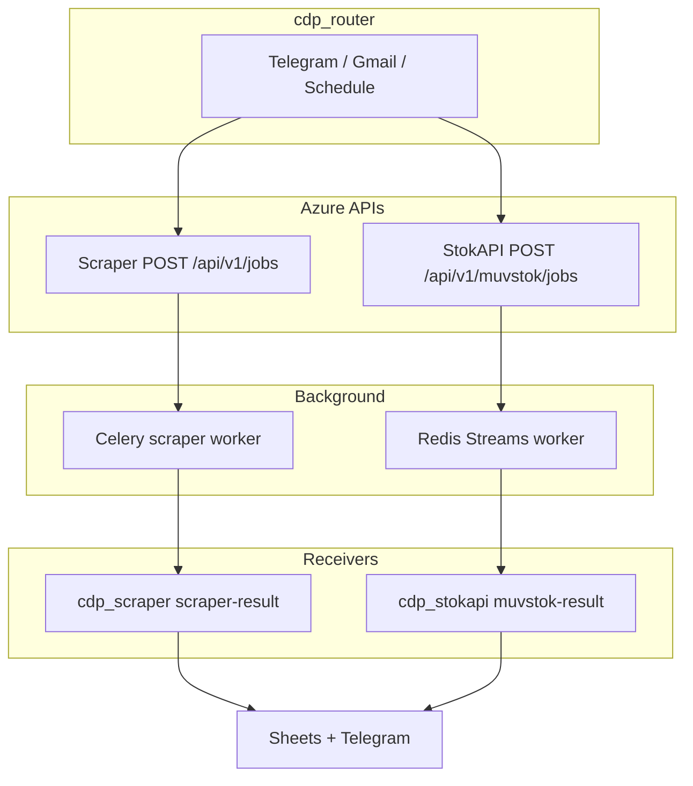

# CDP Architecture

**Updated:** 2026-05-27. Canonical platform design doc (consolidates [PLATFORM_OVERVIEW.md](PLATFORM_OVERVIEW.md), [architecture/DUAL_PIPELINE.md](architecture/DUAL_PIPELINE.md), and agent routing).

## Purpose

CDP automates automotive parts intelligence: public-site price scraping and internal Muvstok stock lookup, orchestrated by n8n, delivered to Google Sheets and Telegram.

## Monorepo layout

```text
cdp-app/
├── scrapers/           # Scraper API + Celery + cdp_scraper receiver
├── muvstok-api/        # API Diversos (StokAPI) + Redis Streams worker + cdp_stokapi
├── n8n/                # Router Code (src/), workflows, settings  ← canonical (Phase 1)
├── contracts/          # Shared JSON Schema (jobs + callbacks)
├── docs/               # Platform documentation
├── scripts/            # sync-all-n8n.sh, smoke_dual_pipeline.sh
└── .agent/             # Tier 1 platform agent workspace
```

**Phase 1 (complete):** Workflow JSON lives only at repo root `n8n/`. Legacy docs under `scrapers/n8n/docs/` are deprecated. See [decisions/ADR-0003-monorepo-n8n-layout.md](decisions/ADR-0003-monorepo-n8n-layout.md).

## Services

| Service | Directory | Queue | Azure (prod) |
|---------|-----------|-------|----------------|
| Scraper | `scrapers/` | Celery + Redis DB 0/1 | `cdp-scrapers-api-prod`, `cdp-scrapers-worker-prod` |
| StokAPI | `muvstok-api/` | Redis Streams | `cdp-muv-api`, `cdp-muv-worker` |
| n8n | `n8n/` | — | `cdp-n8n-prod` |

Shared: resource group `automation`, Key Vault `cdp-scrapers-kv-prod`, ACR `cdpscraperprodacr.azurecr.io`.

## Dual pipeline

Commands `.analisar` / `.sku` dispatch **Scraper + StokAPI in parallel** for all valid SKUs. Router sends `force_refresh: false`; scraper worker applies **24h cache** before Playwright.



Details: [architecture/DUAL_PIPELINE.md](architecture/DUAL_PIPELINE.md).

## Integration rules

- **Two APIs, one router** — no shared Python between services.
- **Callbacks only** — workers POST to n8n webhooks; no worker-to-worker HTTP.
- **Contracts:** [contracts/](../contracts/) mirror Pydantic models.

## n8n workflows (production)

| Workflow | ID | Repo (canonical) | Webhook |
|----------|-----|------------------|---------|
| `cdp_router` | `6id6dkinK9xTLfsb` | `n8n/workflows/cdp_router.json` | Triggers |
| `cdp_scraper` | `VfBSV3WU6on8BXm8` | `n8n/workflows/cdp_scraper.json` | `scraper-result` |
| `cdp_stokapi` | `t160mzGPYYlJcrjZ` | `n8n/workflows/cdp_stokapi.json` | `muvstok-result` |
| `cdp_progress` | _(import)_ | `n8n/workflows/cdp_progress.json` | Schedule |

Sync: `python3 scripts/sync_workflow_code_from_shared.py` → `make sync-n8n` (user approval for publish). Live IDs: [n8n/LIVE_WORKFLOWS.md](n8n/LIVE_WORKFLOWS.md).

## Agent architecture (three tiers)

| Tier | Entry | Owns |
|------|--------|------|
| Platform | [AGENTS.md](../AGENTS.md), [.agent/index.md](../.agent/index.md) | Router, dual pipeline, `n8n/src/`, contracts |
| Scraper | [scrapers/AGENTS.md](../scrapers/AGENTS.md) | Playwright, Celery, cache, scraper receiver |
| StokAPI | [muvstok-api/AGENTS.md](../muvstok-api/AGENTS.md) | Muvstok worker, stokapi receiver |

Full guide: [architecture/AGENT_ARCHITECTURE.md](architecture/AGENT_ARCHITECTURE.md).

## API quick reference

See [PLATFORM_OVERVIEW.md](PLATFORM_OVERVIEW.md#api-quick-reference) for endpoint tables, or [.agent/standards/api-design.md](../.agent/standards/api-design.md).

## Quality gates

```bash
make -C scrapers test lint
make check-muvstok
python3 scripts/sync_workflow_code_from_shared.py   # after n8n/src edits
```

## Deprecated

- `cdp_muvstok-api_starter`, `muvstok_job_sender` / `muvstok_job_receiver`
- Legacy names `cdp_analise` / `cdp_resultado`
