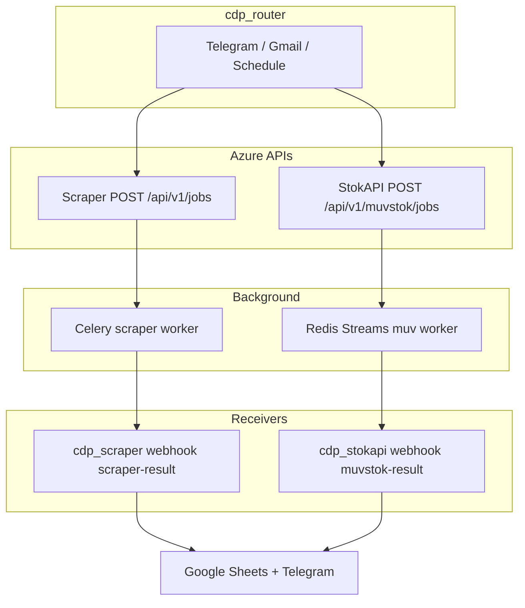

# CDP Platform Overview

**Updated:** 2026-05-27

The **CDP** (Customer Data Platform) monorepo automates automotive parts intelligence: public-site price scraping and internal Muvstok stock lookup, orchestrated by n8n and delivered to Google Sheets + Telegram.

## Monorepo layout

```text
cdp-app/
├── scrapers/           # Scraper API + Celery workers + cdp_router + cdp_scraper
├── muvstok-api/        # API Diversos (StokAPI) + Redis worker + cdp_stokapi
├── n8n/                # Router Code (src/), workflows, settings
├── docs/               # Cross-cutting architecture (this file, dual pipeline, live IDs)
├── scripts/            # sync-all-n8n.sh, smoke_dual_pipeline.sh
└── .agent/             # Platform-level AI agent knowledge
```

Each service (`scrapers/`, `muvstok-api/`) may have its own git history. Platform-wide changes (router logic) live at the monorepo root.

## Services

| Service | User-facing name | Stack | Azure apps |
|---------|------------------|-------|------------|
| **scrapers** | CDP Scraper | FastAPI, Playwright, Celery, PostgreSQL, Redis DB 0+1 | `cdp-scrapers-api-prod`, `cdp-scrapers-worker-prod` |
| **muvstok-api** | API Diversos | FastAPI, Redis Streams worker, PostgreSQL | `cdp-muv-api`, `cdp-muv-worker` |
| **n8n** | — | Workflows on `cdp-n8n-prod` | `https://automacao.tktechnologies.com.br` |

Shared Azure resource group: **`automation`**. Secrets: Key Vault `cdp-scrapers-kv-prod`. Registry: `cdpscraperprodacr.azurecr.io`.

Database and Redis layout: [DATABASE.md](DATABASE.md).

## Dual pipeline (`.analisar` / `.sku`)

Both commands run **Scraper + StokAPI in parallel** for all valid SKUs (scraper jobs batched by `CDP_SCRAPER_BATCH_SIZE`, default 100). Details: [architecture/DUAL_PIPELINE.md](architecture/DUAL_PIPELINE.md).



### Scraper arm

- Router builds `POST /api/v1/jobs` with `force_refresh: false` and sites `gm, ml, vw, eu, pecadireta`.
- Worker uses **24h scrape cache** (Redis DB 1 + PG fallback) before Playwright.
- Callback: `POST …/webhook/scraper-result` → **cdp_scraper**.

### StokAPI arm

- Router inline HTTP (`n8n/src/router_stokapi.js`) — **no** Execute Workflow sub-workflow.
- Worker processes SKUs sequentially (~0.75s between SKUs), persists to PostgreSQL, callbacks n8n.
- Callback: `POST …/webhook/muvstok-result` → **cdp_stokapi**.

## n8n workflows (production)

| Workflow | ID | Repo path |
|----------|-----|-----------|
| `cdp_router` | `6id6dkinK9xTLfsb` | `n8n/workflows/cdp_router.json` |
| `cdp_scraper` | `VfBSV3WU6on8BXm8` | `n8n/workflows/cdp_scraper.json` |
| `cdp_stokapi` | `t160mzGPYYlJcrjZ` | `n8n/workflows/cdp_stokapi.json` |
| `cdp_progress` | _(import in n8n)_ | `n8n/workflows/cdp_progress.json` |

Live reference: [n8n/LIVE_WORKFLOWS.md](n8n/LIVE_WORKFLOWS.md).

**Router Code sources** (edit here, then sync):

| File | Purpose |
|------|---------|
| `n8n/src/router_limitar_skus.js` | Batch metadata; all valid SKUs pass through |
| `n8n/src/formatar_payload_scraper.js` | Scraper job bodies |
| `n8n/src/router_stokapi.js` | StokAPI job bodies |
| `n8n/src/emparelhar_scraper.js` | Mark sheet rows PROCESSADO |
| `n8n/src/router_error_stokapi.js` | StokAPI dispatch error handling |
| `n8n/src/router_register_run.js` | Persist active run + `POST /dispatch-runs` |
| `n8n/src/router_status_prepare.js` | `.status` command — resolve active run |
| `n8n/src/router_status.js` | Format dual-pipeline status message |
| `n8n/src/progress_poll.js` | `cdp_progress` — poll active runs |
| `n8n/src/progress_format.js` | `cdp_progress` — format + PATCH run state |

```bash
make sync-n8n   # inject shared JS → JSON → push router + receivers
```

## Progress visibility

Dual-pipeline runs expose live progress on both APIs and via Telegram:

- **On demand:** `.status` / `.andamento` / `.progresso` in `cdp_router` (polls job IDs from staticData or `GET /dispatch-runs/active/for-chat/{chat_id}`).
- **Proactive:** `cdp_progress` workflow (schedule) notifies when SKU count and percent thresholds are met.
- **Scraper:** `GET /api/v1/jobs/{id}` returns `items_processed`, `progress_pct`, `estimated_seconds_remaining`; registry at `/api/v1/dispatch-runs/*`.
- **StokAPI:** `GET /api/v1/muvstok/jobs/{id}` returns live counters while `processing`.

Details: [architecture/DUAL_PIPELINE.md](architecture/DUAL_PIPELINE.md), [n8n/LIVE_WORKFLOWS.md](n8n/LIVE_WORKFLOWS.md).

## API quick reference

### Scraper (`scrapers/`)

| Method | Path | Notes |
|--------|------|-------|
| `POST` | `/api/v1/jobs` | Async batch; Celery or local backend |
| `GET` | `/api/v1/jobs/{id}` | Job status + results (+ `items_processed`, `progress_pct` while running) |
| `POST` | `/api/v1/dispatch-runs` | Register dual-pipeline run (router) |
| `GET` | `/api/v1/dispatch-runs/active` | Active runs (progress poller) |
| `GET` | `/api/v1/dispatch-runs/active/for-chat/{chat_id}` | Active run for Telegram chat |
| `PATCH` | `/api/v1/dispatch-runs/{id}` | Update progress notification state |
| `POST` | `/api/v1/lookup` | Sync single-SKU (cache in API process) |
| `GET` | `/api/v1/health` | Liveness |

Auth: `X-API-Key`. Active sites: `gm`, `ml`, `vw`, `eu`, `pecadireta`, `melibox` (melibox not in default job list).

### StokAPI / API Diversos (`muvstok-api/`)

| Method | Path | Notes |
|--------|------|-------|
| `POST` | `/api/v1/muvstok/jobs` | 202 Accepted; Redis Streams queue |
| `GET` | `/api/v1/muvstok/jobs/{id}` | Job status + paginated items (+ live `progress_pct` while processing) |
| `GET` | `/api/v1/muvstok/health` | Liveness (`service: api-diversos`) |

Auth: `X-API-Key`. Internal paths/tables keep `muvstok` prefix for compatibility.

## Agent architecture

Three tiers: **platform** (`.agent/`) → **service** (`scrapers/.agent/`, `muvstok-api/.agent/`) → **n8n contracts**.

Full guide: [architecture/AGENT_ARCHITECTURE.md](architecture/AGENT_ARCHITECTURE.md).

| Tier | Entry |
|------|--------|
| Platform | [AGENTS.md](../AGENTS.md), [.agent/index.md](../.agent/index.md) |
| Scraper | [scrapers/AGENTS.md](../scrapers/AGENTS.md) |
| StokAPI | [muvstok-api/AGENTS.md](../muvstok-api/AGENTS.md) |

## Quality gates

```bash
# Monorepo
make sync-n8n
make check-muvstok
make -C scrapers test lint

# Muvstok only
cd muvstok-api && uv run ruff check . && uv run mypy .
```

## Deprecated / do not use

- `cdp_muvstok-api_starter` (`PXLHDzRbBVgs8Xl2`) — manual sheet sender; production uses **cdp_router**.
- `muvstok_job_sender.json` / `muvstok_job_receiver.json` — removed; only `cdp_stokapi.json` remains.
- Legacy names `cdp_analise` / `cdp_resultado` — replaced by `cdp_router` / `cdp_scraper`.
