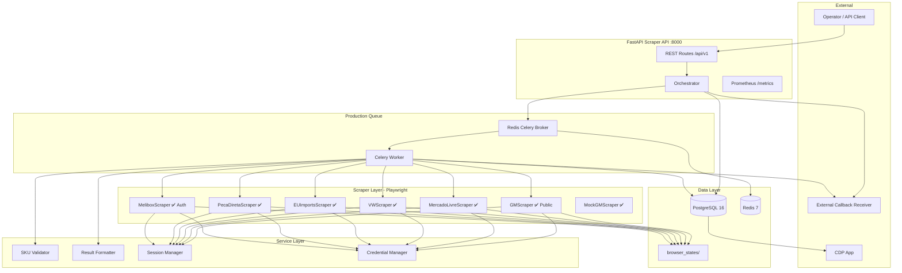
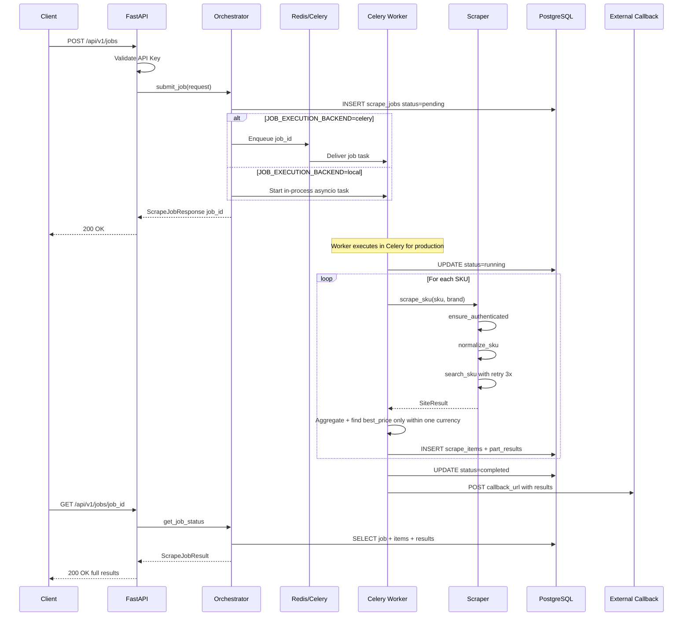
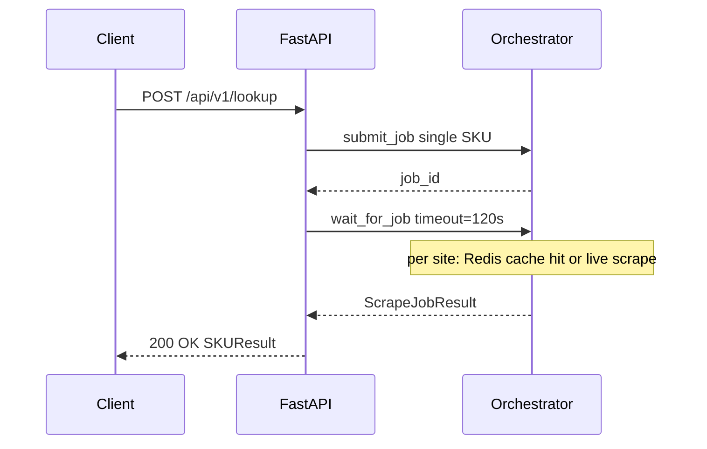
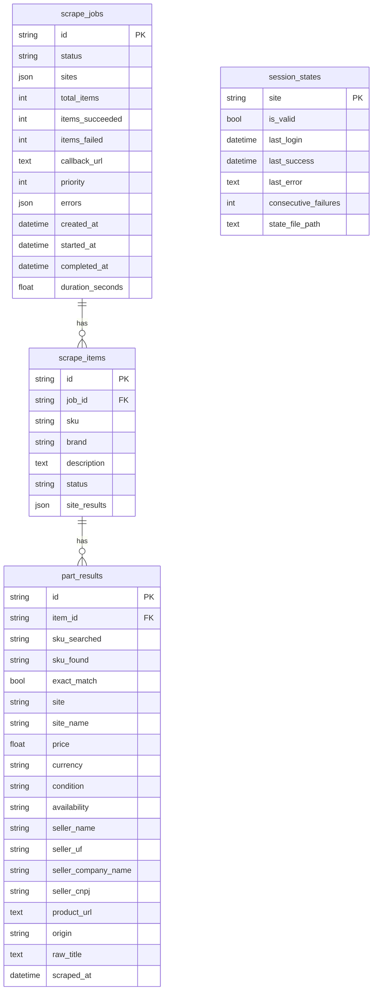

# CDP Scraper — System Overview

> Automated automotive parts price comparison across multiple supplier websites.
> Operators that spent **~5 hours/day** manually searching parts now run this in **~90 minutes unattended**.

---

## Unified `.analisar` (2026-05-22)

> **Canonical (2026-06):** `.analisar` / `.sku` dispatch **all valid SKUs** by default (optional `CDP_DISPATCH_SAMPLE_SIZE` in router). Platform truth: [../../docs/architecture/DUAL_PIPELINE.md](../../docs/architecture/DUAL_PIPELINE.md).

One Telegram/e-mail command runs **scraper (sites)** and **Muvstok (stock)** in parallel. Historical meeting deck: `docs/meetings/MEETING_DUAL_ANALISE_NOVA_ARQUITETURA.md` (may mention legacy 5-SKU sampling).

## Production status

See `docs/MAINTENANCE_CHECKPOINT.md` (updated 2026-06-02) for the live handoff.

- Azure: `cdp-scrapers-api-prod`, `cdp-scrapers-worker-prod`, N8N `https://automacao.tktechnologies.com.br`
- Scrape cache: validated on `/lookup` and `/jobs`
- **P0:** Brazilian ISP proxy in Key Vault — `scripts/proxy_readiness_check.py`, `scripts/proxy_site_smoke.py`, `.agent/workflows/proxy-rollout.md`
- Melibox: blocked on Azure egress without BR ISP; archived sites need per-site smoke before re-registry
- Live n8n: `../../docs/n8n/LIVE_WORKFLOWS.md`

Production queue note:
- The Celery worker uses `NullPool` for async PostgreSQL sessions when
  `JOB_EXECUTION_BACKEND=celery`, preventing asyncpg connection reuse across
  Celery task event loops.
- Async Azure PostgreSQL SSL URL flags are normalized into asyncpg
  `connect_args`.
- Shared scraper anti-bot behavior now lives in `BaseScraper`: realistic
  Chromium context profile, configurable UA list, persistent storage state,
  proxy context assignment, action pacing, main-document `403` / `429`
  detection, bounded backoff, and explicit `blocked` site results.

---

# 1. System Architecture

> 💡 Paste the code below into a Notion **Code block** with language set to **Mermaid**.



### Component Status

| Component | Technology | Status | Purpose |
|---|---|---|---|
| **API** | FastAPI + Uvicorn | ✅ Done | REST endpoints for jobs, lookups, health |
| **GM Scraper** | Playwright (Chromium) | ✅ Implemented | Public Peça Chevrolet search with CEP session setup |
| **Mock GM** | Pure Python | ✅ Done | E2E testing without credentials |
| **ML Scraper** | Playwright | ✅ Implemented | Mercado Livre marketplace |
| **VW Scraper** | Playwright | ✅ Implemented | VW parts portal |
| **EU Imports Scraper** | Playwright | ✅ Implemented | European import catalog |
| **GoParts Scraper** | Playwright/API target | Archived | Kept as reference; not in active registry, demo-runnable |
| **Procura Peças / eBay** | Playwright | Archived | Code in repo; not in active registry, demo-runnable |
| **Peca Direta Scraper** | Playwright | ✅ Implemented | Brazilian direct search |
| **Melibox Scraper** | Playwright | ✅ Auth baseline | Authenticated **advProductPosition** (Frase/Palavra + Enviar) |
| **Orchestrator** | asyncio | ✅ Done | Fan-out jobs, aggregate results |
| **PostgreSQL** | 16-alpine | ✅ Done | Persistent storage |
| **Redis** | 7-alpine | ✅ Queue ready | Celery broker/result backend |
| **Celery Worker** | Celery + Redis | ✅ Added | Durable production job execution |
| **Monitoring** | Prometheus client | ✅ Done | Metrics + health gauges |

---

# 2. Complete Dataflow

## 2.1 Batch Job Flow (Primary)

> 💡 Paste into a Notion **Code block → Mermaid**.



## 2.2 Quick Lookup Flow (Synchronous)

> 💡 Paste into a Notion **Code block → Mermaid**.



## 2.3 SKU Normalization Rules

| Rule | Input | Output | When |
|---|---|---|---|
| Strip special chars | `A-000.1234/567` | `A0001234567` | Always |
| Uppercase | `a0001234567` | `A0001234567` | Always |
| Mercedes EU rule | `A0001234567` (brand=Mercedes, site=EU) | `0001234567` | Mercedes + EU site only |
| ML "NEW only" | Results with condition=USED | Filtered out | Mercado Livre only |
| Price parse (BRL) | `R$ 1.234,56` | `1234.56` | Brazilian sites |
| Price parse (USD/EUR) | `$1,234.56` | `1234.56` | European site |

## 2.4 Database Schema

> 💡 Paste into a Notion **Code block → Mermaid**.



---

# 3. User Guide

## 3.1 Initial Setup

```bash
# 1. Clone + install
make setup

# 2. Configure credentials in .env
#   CREDENTIAL_GM_USER=your_dealer_login
#   CREDENTIAL_GM_PASS=your_dealer_password
#   API_KEY=generate-a-secure-key

# 3. Start dev server
make dev
# → FastAPI on http://localhost:8000
```

## 3.2 API Endpoints

| Method | Path | Auth | Description |
|---|---|---|---|
| POST | `/api/v1/jobs` | ✅ X-Api-Key | Submit batch scraping job |
| GET | `/api/v1/jobs/{id}` | ✅ X-Api-Key | Get job status/results |
| POST | `/api/v1/lookup` | ✅ X-Api-Key | Quick single-SKU lookup |
| GET | `/api/v1/health` | ❌ None | Health check |

## 3.3 API Examples

**Submit a Batch Job:**
```bash
curl -X POST http://localhost:8000/api/v1/jobs \
  -H "Content-Type: application/json" \
  -H "X-Api-Key: YOUR_API_KEY" \
  -d '{
    "items": [
      {"sku": "93338835", "brand": "GM"},
      {"sku": "52102242", "brand": "GM"}
    ],
    "sites": ["gm"],
    "callback_url": "http://localhost:5678/webhook/scraper-callback"
  }'
```

**Check Job Status:**
```bash
curl http://localhost:8000/api/v1/jobs/JOB_ID \
  -H "X-Api-Key: YOUR_API_KEY"
```

**Quick Lookup (blocks until done):**
```bash
curl -X POST http://localhost:8000/api/v1/lookup \
  -H "Content-Type: application/json" \
  -H "X-Api-Key: YOUR_API_KEY" \
  -d '{"sku": "93338835", "brand": "GM", "sites": ["gm"]}'
```

## 3.4 Mock Testing

When `MOCK_SCRAPERS=true`, the mock scraper activates with 4 test SKUs:
`93338835`, `52102242`, `24578331`, `94703032`.

```bash
# Force mock mode
MOCK_SCRAPERS=true make dev

# Run tests
make test
```

## 3.5 Development Commands

| Command | Description |
|---|---|
| `make dev` | Start API (Postgres + Redis auto-started) |
| `make dev-full` | Start local Docker Compose stack |
| `make test` | Run test suite |
| `make test-cov` | Tests with coverage report |
| `make lint` | Run ruff + mypy |
| `make format` | Auto-format code |
| `make migrate` | Run Alembic migrations |
| `make docker-up` | Start Docker Compose services |
| `make docker-logs` | Tail API container logs |

## 3.6 Adding a New Scraper

1. Create `src/scrapers/newsite.py` inheriting `BaseScraper`
2. Implement: `site_id`, `site_name`, `login(page)`, `search_sku(page, sku, brand)`
3. Register in `src/scrapers/__init__.py` → `SCRAPER_REGISTRY`
4. Add credentials to `.env.example` + `src/config.py`
5. Add tests in `tests/test_scrapers/`
6. Reference: `src/scrapers/gm.py`

## 3.7 Implementation Phases

| Phase | Scope | Status |
|---|---|---|
| **Phase 1** | GM scraper + FastAPI + PostgreSQL + Docker Compose | ✅ Complete |
| **Phase 2** | Real scraper implementations and source-specific rules | 🔄 In Progress |
| **Phase 3** | Mock testing and local verification | ✅ Complete |
| **Phase 4** | Azure infrastructure, deployment, proxy rotation, scaling | 🔄 In Progress |
| **AI Maintenance** | Specs, startup prompt, changelog, audit workflow | ✅ Active |

## 3.8 Key Files

| File | Purpose |
|---|---|
| `src/main.py` | FastAPI app entry point + lifespan hooks |
| `src/config.py` | All settings via pydantic-settings |
| `src/api/routes.py` | REST endpoints: /jobs, /lookup, /health |
| `src/services/orchestrator.py` | Job engine: submit, execute, aggregate |
| `src/scrapers/base.py` | Abstract scraper with auth + retry + session |
| `src/scrapers/gm.py` | GM reference scraper |
| `src/utils/proxy_manager.py` | Proxy endpoint parsing and round-robin selection |
| `src/models/database.py` | SQLAlchemy ORM models |
| `.agent/prompts/agent-startup.md` | Fresh AI-agent startup prompt |
| `src/models/schemas.py` | Pydantic request/response models |
| `src/services/sku_validator.py` | SKU normalization + price parsing |
| `src/scrapers/session_manager.py` | Browser session TTL + health tracking |
